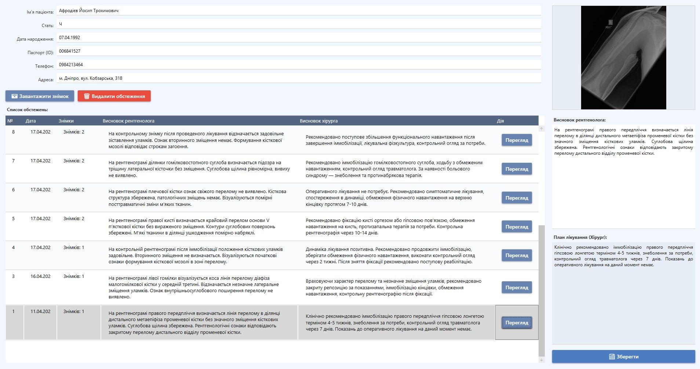
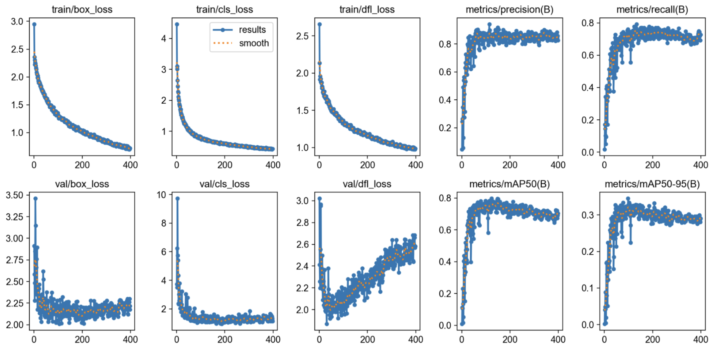
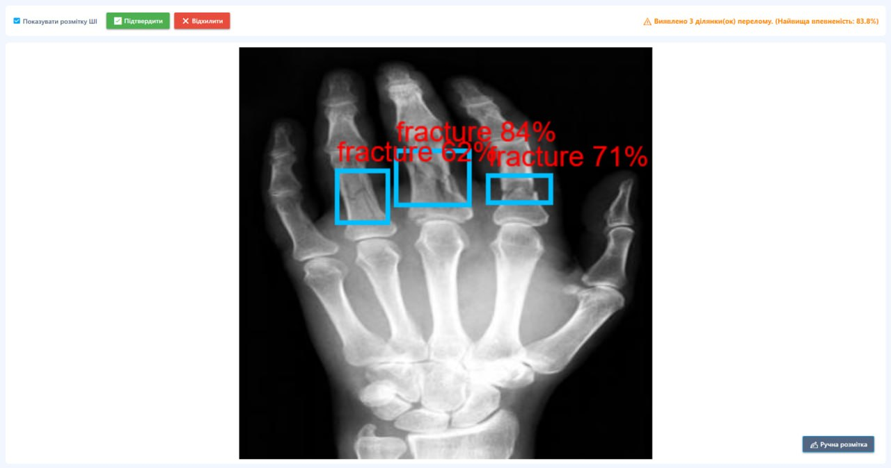

# Hospital X-Ray Fracture Detection System

A local desktop medical information system for assisting radiologists in detecting bone fractures on X-ray images, with a built-in YOLOv8 ONNX inference module and a controlled human-in-the-loop model retraining pipeline.



> **Qualification project.** A functional prototype of an assistive clinical decision-support tool. Not a certified diagnostic device — every AI result is verified by a radiologist.

---

## Tech Stack

**Application**
- C# / .NET — WPF desktop application
- 3-layer architecture (UI / BLL / DAL)
- Entity Framework Core + SQL Server (local)
- ASP.NET Core Identity (role-based access)
- Dependency Injection (Microsoft.Extensions.DependencyInjection)

**AI / Machine Learning**
- YOLOv8m (Ultralytics) — fracture object detection
- ONNX Runtime — local in-process inference (no cloud, no patient data leaves the machine)
- Python / Ultralytics — controlled local retraining pipeline

**Testing**
- xUnit (unit + integration tests)
- EF Core InMemory (isolated integration tests)

---

## Key Idea

The system models the full clinical route for handling radiological data — from patient registration to AI analysis, doctor verification, and conclusion — entirely on a local machine. The AI never makes the final decision: it highlights a suspicious region, and the radiologist confirms, rejects, or corrects it. Corrected cases feed a controlled retraining loop that improves the model over time, without any medical data ever leaving the local environment.

---

## Features

### Role-based clinical workflow
Four user roles, each with its own permissions enforced by `RolePermissionService`:

- **Administrator** — manages staff accounts, reviews retraining requests, builds datasets, launches local retraining, and activates new model versions.
- **Nurse / Registrar** — registers patients, manages medical cards and examinations, uploads X-ray images.
- **Radiologist** — runs AI analysis, reviews bounding boxes and confidence scores, confirms / rejects / corrects results, performs manual annotation, writes radiology conclusions.
- **Surgeon (Traumatologist)** — reviews examination results and the radiologist's conclusion, writes a treatment plan (read-only on AI results).

### AI fracture detection
- Local ONNX inference via `AIAnalyzerService` — loads the active model, preprocesses the image (letterbox 640×640), runs YOLOv8, applies NMS, and returns bounding boxes with confidence scores.
- Results are drawn over the X-ray; each detection is stored as a structured `DetectionBox` (coordinates, confidence, class, source).
- Re-opening an image reloads the saved result by `MedicalImageId` — no re-inference needed.
- Every result records which model version produced it (`ModelName`, `ModelVersion`, `ModelPath`) for full traceability.

### Human-in-the-loop verification
- Each AI result has a review status: `Pending → Confirmed / Rejected / Corrected`.
- If the model misses or mislocalises a fracture, the radiologist draws a manual annotation, saved as a YOLO-format label file.
- Mistakes are classified as `FalsePositive`, `FalseNegative`, or `CorrectedPositive` and turned into `RetrainingRequest` records.

### Controlled retraining pipeline
- The administrator reviews retraining requests, approves valid ones, and `DatasetExportService` builds a YOLO-compatible dataset (`images/train`, `images/val`, `labels/train`, `labels/val`, `data.yaml`, `dataset_summary.json`).
- `ModelTrainingService` launches a local Python / Ultralytics retraining process — no data is sent to external services.
- New models are registered as separate `ModelVersion` records; the working model is **never** swapped automatically. The administrator reviews results and manually activates a new version.

---

## Architecture

Three-layer architecture, registered through a central DI container (`ConfigureUIService`):

```
WPFhospitalXray (UI)   WPF windows — display data, handle user actions,
                       call BLL services. No DB access, no inference here.
        │
        ▼
BLL (Business Logic)   Services, interfaces, DTOs. AIAnalyzerService runs
                       ONNX inference; other services orchestrate the
                       clinical workflow, file storage, dataset export,
                       and retraining.
        │
        ▼
DAL (Data Access)      Entities, repositories, DbContext, migrations.
                       Hides EF Core details behind repository interfaces.
```

WPF windows receive their services through constructors; services work with repositories through interfaces. Large files (X-rays, label files, datasets) live on the file system; the database stores only paths and metadata.

### Domain model

The core clinical entities and their relationships:

```
Patient ── MedicalCard ── Examination ──┬── MedicalImage ── AnalysisResult ── DetectionBox
                                         └── Conclusion (Radiologist / Surgeon)

RetrainingRequest ── (FalsePositive / FalseNegative / CorrectedPositive)
ModelVersion      ── tracks model name, version, ONNX/PT paths, metrics, active flag
```

| Entity | Purpose |
|--------|---------|
| `Patient` | Personal data; root of the clinical route |
| `MedicalCard` | Container for a patient's medical history |
| `Examination` | A single examination (can hold multiple images and conclusions) |
| `MedicalImage` | X-ray record (file path + metadata; file itself on disk) |
| `AnalysisResult` | One AI analysis of one image + which model produced it |
| `DetectionBox` | A single detected region (X, Y, W, H, confidence, class, source) |
| `Conclusion` | Radiologist or Surgeon conclusion |
| `RetrainingRequest` | A verified case queued for retraining |
| `ModelVersion` | Registered AI model version with metrics and active flag |

### Business-logic services

| Service | Responsibility |
|---------|----------------|
| `AuthService` | Login and role resolution |
| `RolePermissionService` | Centralised permission checks per role |
| `PatientService` / `MedicalCardService` / `ExaminationService` | Clinical record management |
| `MedicalImageService` / `ImageStorageService` | Image records + physical file storage |
| `AIAnalyzerService` | ONNX inference, returns `FractureDetectionDto` |
| `AnalysisResultService` | Saves AI results + `DetectionBox` records |
| `DatasetService` / `DatasetExportService` | Label files + YOLO dataset assembly |
| `RetrainingRequestService` | Creates and processes retraining requests |
| `ModelTrainingService` | Launches the Python / Ultralytics retraining process |
| `ModelVersionService` | Registers, lists, and activates model versions |
| `ConclusionService` | Stores radiologist / surgeon conclusions |
| `ApplicationPathService` | Centralised paths to storage, models, datasets |

---

## The AI Model

The YOLOv8m model was developed through two rounds of experimentation before integration.

### Dataset

- **1 036 annotated X-ray images**, single class `Fracture`, YOLO format
- Split: 781 train / 99 validation / 156 test
- Sourced from Roboflow Universe (homogeneous hand/forearm radiographs)

### Round 1 — training strategy (2×2 experiment)

Four variants compared across two axes: weight initialisation (scratch vs. transfer learning) and augmentation (none vs. radiology-adapted). Training: YOLOv8m, 640px, batch 16, AdamW, cosine LR, early stopping (patience 100).

| Experiment | Precision | Recall | mAP50 | mAP50-95 |
|---|---|---|---|---|
| Scratch, no augmentation | 0.688 | 0.458 | 0.483 | 0.187 |
| Scratch + radiology augmentation | 0.858 | **0.760** | 0.745 | **0.321** |
| Transfer, no augmentation | 0.824 | 0.495 | 0.571 | 0.234 |
| Transfer + radiology augmentation | 0.835 | 0.703 | **0.752** | 0.318 |

**Augmentation had the largest effect** — +0.26 mAP50 over the no-augmentation baseline. Since X-rays are greyscale, hue/saturation augmentation was disabled; only moderate brightness, rotation, scale, shift, horizontal flip, and limited mosaic were used. Best single checkpoint (`best.pt`) reached **mAP50 = 0.797**.

### Round 2 — fine-tuning on an extended dataset

The initial model scored mAP50 = 0.794 on the original test set but only **0.094** on a new set of radiographs — confirming the need for fine-tuning. Six strategies were compared (training-set composition × layer freezing), at a reduced learning rate of 0.0001.

| Strategy | New test mAP50 | Old test mAP50 | Combined mAP50 |
|---|---|---|---|
| Baseline (no fine-tuning) | 0.094 | 0.794 | 0.643 |
| New data only | 0.708 | 0.205 | 0.296 |
| Mixed 50 / 50 | 0.656 | 0.762 | 0.737 |
| **Mixed 67 % old / 33 % new** ⭐ | **0.695** | **0.786** | **0.762** |

Training only on new data caused **catastrophic forgetting** — the old-set score collapsed from 0.794 to 0.205. Layer freezing consistently underperformed full fine-tuning at a low learning rate. The best balance was a **67 % old / 33 % new** mixture: the combined-set mAP50 rose from 0.643 to **0.762** while the original-set score dropped by less than 0.01.



### Final model

`E5_mix_67old_33new_full` (best checkpoint) was exported to ONNX (`imgsz=640`) and integrated into the WPF app via ONNX Runtime.



> **Disclaimer.** The model is an assistive tool only — it highlights suspicious regions. The confusion matrix shows some fractures can still be missed, so the radiologist makes the final decision.

---

## Testing

Tests live in `WPFhospitalXray.Tests/` (xUnit) — 19 automated tests total.

- **14 unit tests** — `RolePermissionService` access rules per role, `ApplicationPathService` path generation, status enums (`AnalysisReviewStatus`, `RetrainingRequestType`, `RetrainingRequestStatus`, `ModelVersionStatus`), `ModelVersion` entity.
- **5 integration tests** (EF Core InMemory) — the clinical route: create patient → auto-create medical card → examination → image → save AI result with `DetectionBox` → create retraining request. Verifies model metadata (name, version, path) is persisted with each result.

Functional testing covered three end-to-end scenarios through the WPF UI: the full patient route with AI confirmation (C1), the false-negative case with manual annotation (C2), and the administrative retraining cycle (C3).

---

## Project Structure

```
WPFhospitalXray/
├── WPFhospitalXray/          UI layer (WPF)
│   ├── MainWindow            role-dependent main window
│   ├── MedicalCardWindow     patient card: examinations, images, conclusions
│   ├── XRayViewerWindow      image viewer + AI analysis + manual markup
│   ├── AdminPanel            staff management
│   ├── RetrainManagerWindow  retraining requests + model versions
│   ├── MarkupPreviewWindow   review manual annotations
│   ├── ConfigureUIService    central DI registration
│   └── Scripts/retrain_yolo.py   local Ultralytics retraining script
│
├── BLL/                      business logic
│   ├── Service/              16 services (see table above)
│   ├── Interface/            service contracts
│   ├── DTOs/                 data transfer objects per feature
│   └── Constants/            RoleNames
│
└── DAL/                      data access
    ├── Entity/               10 domain entities
    ├── Repositories/         9 repositories
    ├── Interfaces/           repository contracts
    ├── DBContext/            ApplicationDBContext + factory
    └── Migrations/           EF Core migrations
```

---

## Key Technical Decisions

**AI never decides alone (human-in-the-loop).** Every AI result starts as `Pending` and must be confirmed, rejected, or corrected by a radiologist. This is the core safety principle for medical AI — the model assists, the doctor decides.

**Controlled retraining, not auto-learning.** The working model is never replaced automatically after a correction. Corrections accumulate as verified cases; the administrator builds a dataset, runs retraining, reviews metrics, and manually activates a new version. This keeps model updates auditable.

**Model-version traceability.** Each `AnalysisResult` stores the exact model name, version, and path that produced it. Months later you can answer "which model version generated this result?" — essential for clinical accountability.

**Local-only processing.** No patient data ever leaves the machine. Inference runs locally via ONNX Runtime; retraining runs locally via Python/Ultralytics. There is no cloud dependency.

**Files on disk, paths in DB.** X-rays, label files, and datasets live on the file system; the database stores only paths and metadata. Storing large images directly in the database would complicate maintenance.

**Catastrophic forgetting, handled.** The fine-tuning experiment explicitly measured and avoided catastrophic forgetting — training only on new data destroyed old-set accuracy, so a mixed 67/33 dataset was chosen to adapt to new data while preserving prior knowledge.
